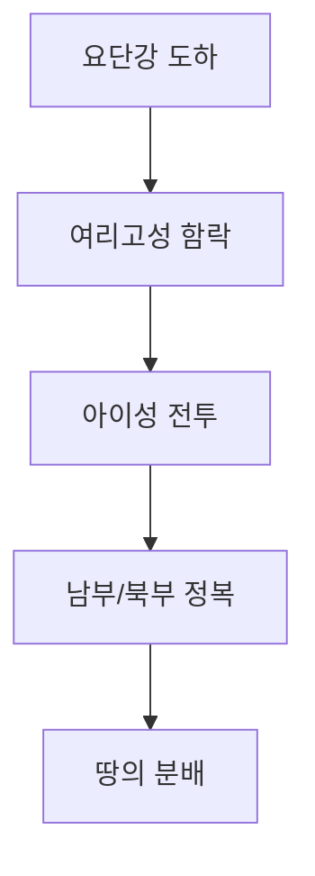

# 여호수아 1장

📖 **안내**: 이 파일은 대조 분석용으로 제작되었습니다. 읽기 전 [FAQ.md](../../FAQ.md)를 참고하시면 구조를 이해하는 데 도움이 됩니다.

### 1절
여호와의 종 모세가 죽은 후에 여호와께서 모세의 시종 눈의 아들 여호수아에게 일러 말씀하시되
*Et factum est post mortem Moysi servi Domini, ut loqueretur Dominus ad Josue filium Nun, ministrum Moysi, et diceret ei :*
וַיְהִ֗י אַחֲרֵ֛י מֹ֥ות מֹשֶׁ֖ה עֶ֣בֶד יְהוָ֑ה וַיֹּ֤אמֶר **יְהוָה֙ אֶל־יְהֹושֻׁ֣עַ בִּן־נ֔וּן מְשָׁרֵ֥ת מֹשֶׁ֖ה לֵאמֹֽר׃**

### 2절
내 종 모세가 죽었으니 이제 너는 이 모든 백성으로 더불어 일어나 이 요단을 건너 내가 그들 곧 이스라엘 자손에게 주는 땅으로 가라
*Moyses servus meus mortuus est : surge, et transi Jordanem istum tu, et omnis populus tecum, in terram quam ego dabo filiis Israël.*
מֹשֶׁ֥ה עַבְדִּ֖י מֵ֑ת וְעַתָּה֩ ק֨וּם עֲבֹ֜ר אֶת־הַיַּרְדֵּ֣ן הַזֶּ֗ה אַתָּה֙ וְכָל־הָעָ֣ם **הַזֶּ֔ה אֶל־הָאָ֕רֶץ אֲשֶׁ֧ר אָנֹכִ֛י נֹתֵ֥ן לָהֶ֖ם לִבְנֵ֥י יִשְׂרָאֵֽל׃**

### 3절
내가 모세에게 말한 바와 같이 무릇 너희 발바닥으로 밟는 곳을 내가 다 너희에게 주었노니
*Omnem locum, quem calcaverit vestigium pedis vestri, vobis tradam, sicut locutus sum Moysi.*
כָּל־מָקֹ֗ום אֲשֶׁ֨ר תִּדְרֹ֧ךְ כַּֽף־רַגְלְכֶ֛ם בֹּ֖ו לָכֶ֣ם **נְתַתִּ֑יו כַּאֲשֶׁ֥ר דִּבַּ֖רְתִּי אֶל־מֹשֶֽׁה׃**

### 4절
곧 광야와 이 레바논에서부터 큰 하수 유브라데에 이르는 헷 족속의 온 땅과 또 해 지는 편 대해까지 너희 지경이 되리라
*A deserto et Libano usque ad fluvium magnum Euphraten, omnis terra Hethæorum usque ad mare magnum contra solis occasum erit terminus vester.*
מֵהַמִּדְבָּר֩ וְהַלְּבָנֹ֨ון הַזֶּ֜ה וְֽעַד־הַנָּהָ֧ר הַגָּדֹ֣ול נְהַר־פְּרָ֗ת כֹּ֚ל אֶ֣רֶץ הַֽחִתִּ֔ים **וְעַד־הַיָּ֥ם הַגָּדֹ֖ול מְבֹ֣וא הַשָּׁ֑מֶשׁ יִֽהְיֶ֖ה גְּבוּלְכֶֽם׃**

### 5절
너의 평생에 너를 능히 당할 자 없으리니 내가 모세와 함께 있던것 같이 너와 함께 있을 것임이라 내가 너를 떠나지 아니하며 버리지 아니하리니
*Nullus poterit vobis resistere cunctis diebus vitæ tuæ : sicut fui cum Moyse, ita ero tecum : non dimittam, nec derelinquam te.*
לֹֽא־יִתְיַצֵּ֥ב אִישׁ֙ לְפָנֶ֔יךָ כֹּ֖ל יְמֵ֣י חַיֶּ֑יךָ כַּֽאֲשֶׁ֨ר הָיִ֤יתִי עִם־מֹשֶׁה֙ **אֶהְיֶ֣ה עִמָּ֔ךְ לֹ֥א אַרְפְּךָ֖ וְלֹ֥א אֶעֶזְבֶֽךָּ׃**

### 6절
마음을 강하게 하라 담대히 하라 너는 이 백성으로 내가 그 조상에게 맹세하여 주리라 한 땅을 얻게 하리라
*Confortare, et esto robustus : tu enim sorte divides populo huic terram, pro qua juravi patribus suis, ut traderem eam illis.*
חֲזַ֖ק וֶאֱמָ֑ץ כִּ֣י אַתָּ֗ה תַּנְחִיל֙ אֶת־הָעָ֣ם הַזֶּ֔ה **אֶת־הָאָ֕רֶץ אֲשֶׁר־נִשְׁבַּ֥עְתִּי לַאֲבֹותָ֖ם לָתֵ֥ת לָהֶֽם׃**

### 7절
오직 너는 마음을 강하게 하고 극히 담대히 하여 나의 종 모세가 네게 명한 율법을 다 지켜 행하고 좌로나 우로나 치우치지 말라 그리하면 어디로 가든지 형통하리니
*Confortare igitur, et esto robustus valde, ut custodias, et facias omnem legem, quam præcepit tibi Moyses servus meus : ne declines ab ea ad dexteram vel ad sinistram, ut intelligas cuncta quæ agis.*
רַק֩ חֲזַ֨ק וֶֽאֱמַ֜ץ מְאֹ֗ד לִשְׁמֹ֤ר לַעֲשֹׂות֙ כְּכָל־הַתֹּורָ֗ה אֲשֶׁ֤ר צִוְּךָ֙ מֹשֶׁ֣ה עַבְדִּ֔י אַל־תָּס֥וּר **מִמֶּ֖נּוּ יָמִ֣ין וּשְׂמֹ֑אול לְמַ֣עַן תַּשְׂכִּ֔יל בְּכֹ֖ל אֲשֶׁ֥ר תֵּלֵֽךְ׃**

### 8절
이 율법책을 네 입에서 떠나지 말게 하며 주야로 그것을 묵상하여 그 가운데 기록한대로 다 지켜 행하라 그리하면 네 길이 평탄하게 될 것이라 네가 형통하리라
*Non recedat volumen legis hujus ab ore tuo : sed meditaberis in eo diebus ac noctibus, ut custodias et facias omnia quæ scripta sunt in eo : tunc diriges viam tuam, et intelliges eam.*
לֹֽא־יָמ֡וּשׁ סֵפֶר֩ הַתֹּורָ֨ה הַזֶּ֜ה מִפִּ֗יךָ וְהָגִ֤יתָ בֹּו֙ יֹומָ֣ם וָלַ֔יְלָה לְמַ֙עַן֙ תִּשְׁמֹ֣ר **לַעֲשֹׂ֔ות כְּכָל־הַכָּת֖וּב בֹּ֑ו כִּי־אָ֛ז תַּצְלִ֥יחַ אֶת־דְּרָכֶ֖ךָ וְאָ֥ז תַּשְׂכִּֽיל׃**

### 9절
내가 네게 명한 것이 아니냐 마음을 강하게 하고 담대히 하라 두려워 말며 놀라지 말라 네가 어디로 가든지 네 하나님 여호와가 너와 함께 하느니라 하시니라
*Ecce præcipio tibi : confortare, et esto robustus. Noli metuere, et noli timere : quoniam tecum est Dominus Deus tuus in omnibus ad quæcumque perrexeris.*
הֲלֹ֤וא צִוִּיתִ֙יךָ֙ חֲזַ֣ק וֶאֱמָ֔ץ אַֽל־תַּעֲרֹ֖ץ וְאַל־תֵּחָ֑ת כִּ֤י עִמְּךָ֙ **יְהוָ֣ה אֱלֹהֶ֔יךָ בְּכֹ֖ל אֲשֶׁ֥ר תֵּלֵֽךְ׃ פ**

### 10절
이에 여호수아가 백성의 유사들에게 명하여 가로되
*Præcepitque Josue principibus populi, dicens : Transite per medium castrorum, et imperate populo, ac dicite :*
וַיְצַ֣ו יְהֹושֻׁ֔עַ אֶת־שֹׁטְרֵ֥י **הָעָ֖ם לֵאמֹֽר׃**

### 11절
진중에 두루 다니며 백성에게 명하여 이르기를 양식을 예비하라 삼일 안에 너희가 이 요단을 건너 너희 하나님 여호와께서 너희에게 주사 얻게 하시는 땅을 얻기 위하여 들어갈 것임이니라 하라
*Præparate vobis cibaria : quoniam post diem tertium transibitis Jordanem, et intrabitis ad possidendam terram quam Dominus Deus vester daturus est vobis.*
עִבְר֣וּ ׀ בְּקֶ֣רֶב הַֽמַּחֲנֶ֗ה וְצַוּ֤וּ אֶת־הָעָם֙ לֵאמֹ֔ר הָכִ֥ינוּ לָכֶ֖ם צֵידָ֑ה כִּ֞י בְּעֹ֣וד ׀ שְׁלֹ֣שֶׁת יָמִ֗ים אַתֶּם֙ עֹֽבְרִים֙ **אֶת־הַיַּרְדֵּ֣ן הַזֶּ֔ה לָבֹוא֙ לָרֶ֣שֶׁת אֶת־הָאָ֔רֶץ אֲשֶׁר֙ יְהוָ֣ה אֱלֹֽהֵיכֶ֔ם נֹתֵ֥ן לָכֶ֖ם לְרִשְׁתָּֽהּ׃ ס**

### 12절
여호수아가 또 르우벤 지파와 갓 지파와
*Rubenitis quoque et Gaditis, et dimidiæ tribui Manasse, ait :*
וְלָרֽאוּבֵנִי֙ וְלַגָּדִ֔י וְלַחֲצִ֖י שֵׁ֣בֶט **הַֽמְנַשֶּׁ֑ה אָמַ֥ר יְהֹושֻׁ֖עַ לֵאמֹֽר׃**

### 13절
므낫세 반 지파에게 일러 가로되 여호와의 종 모세가 너희에게 명하여 이르기를 너희 하나님 여호와께서 너희에게 안식을 주시며 이 땅을 너희에게 주시리라 하였나니 너희는 그 말을 기억하라
*Mementote sermonis, quem præcepit vobis Moyses famulus Domini, dicens : Dominus Deus vester dedit vobis requiem, et omnem terram.*
זָכֹור֙ אֶת־הַדָּבָ֔ר אֲשֶׁ֨ר צִוָּ֥ה אֶתְכֶ֛ם מֹשֶׁ֥ה עֶֽבֶד־יְהוָ֖ה לֵאמֹ֑ר יְהוָ֤ה **אֱלֹהֵיכֶם֙ מֵנִ֣יחַ לָכֶ֔ם וְנָתַ֥ן לָכֶ֖ם אֶת־הָאָ֥רֶץ הַזֹּֽאת׃**

### 14절
너희 처자와 가축은 모세가 너희에게 준 요단 이편 땅에 머무르려니와 너희 용사들은 무장하고 너희의 형제보다 앞서 건너가서 그들을 돕고
*Uxores vestræ, et filii, ac jumenta manebunt in terra, quam tradidit vobis Moyses trans Jordanem : vos autem transite armati ante fratres vestros, omnes fortes manu, et pugnate pro eis,*
נְשֵׁיכֶ֣ם טַפְּכֶם֮ וּמִקְנֵיכֶם֒ יֵשְׁב֕וּ בָּאָ֕רֶץ אֲשֶׁ֨ר נָתַ֥ן לָכֶ֛ם מֹשֶׁ֖ה בְּעֵ֣בֶר הַיַּרְדֵּ֑ן וְאַתֶּם֩ **תַּעַבְר֨וּ חֲמֻשִׁ֜ים לִפְנֵ֣י אֲחֵיכֶ֗ם כֹּ֚ל גִּבֹּורֵ֣י הַחַ֔יִל וַעֲזַרְתֶּ֖ם אֹותָֽם׃**

### 15절
여호와께서 너희로 안식하게 하신 것 같이 너희 형제도 안식하게 되며 그들도 너희 하나님 여호와께서 주시는 땅을 얻게 되거든 너희는 너희 소유지 곧 여호와의 종 모세가 너희에게 준 요단 이편 해 돋는 편으로 돌아와서 그것을 차지할찌니라
*donec det Dominus requiem fratribus vestris sicut et vobis dedit, et possideant ipsi quoque terram quam Dominus Deus vester daturus est eis : et sic revertimini in terram possessionis vestræ, et habitabitis in ea, quam vobis dedit Moyses famulus Domini trans Jordanem contra solis ortum.*
עַ֠ד אֲשֶׁר־יָנִ֨יחַ יְהוָ֥ה ׀ לַֽאֲחֵיכֶם֮ כָּכֶם֒ וְיָרְשׁ֣וּ גַם־הֵ֔מָּה אֶת־הָאָ֕רֶץ אֲשֶׁר־יְהוָ֥ה אֱלֹֽהֵיכֶ֖ם נֹתֵ֣ן לָהֶ֑ם וְשַׁבְתֶּ֞ם לְאֶ֤רֶץ יְרֻשַּׁתְכֶם֙ וִֽירִשְׁתֶּ֣ם **אֹותָ֔הּ אֲשֶׁ֣ר ׀ נָתַ֣ן לָכֶ֗ם מֹשֶׁה֙ עֶ֣בֶד יְהוָ֔ה בְּעֵ֥בֶר הַיַּרְדֵּ֖ן מִזְרַ֥ח הַשָּֽׁמֶשׁ׃**

### 16절
그들이 여호수아에게 대답하여 가로되 당신이 우리에게 명하신 것은 우리가 다 행할 것이요 당신이 우리를 보내시는 곳에는 우리가 가리이다
*Responderuntque ad Josue, atque dixerunt : Omnia quæ præcepisti nobis, faciemus : et quocumque miseris, ibimus.*
וַֽיַּעֲנ֔וּ אֶת־יְהֹושֻׁ֖עַ לֵאמֹ֑ר כֹּ֤ל אֲשֶׁר־צִוִּיתָ֙נוּ֙ **נַֽעֲשֶׂ֔ה וְאֶֽל־כָּל־אֲשֶׁ֥ר תִּשְׁלָחֵ֖נוּ נֵלֵֽךְ׃**

### 17절
우리는 범사에 모세를 청종한것 같이 당신을 청종하려니와 오직 당신의 하나님 여호와께서 모세와 함께 계시던 것 같이 당신과 함께 계시기를 원하나이다
*Sicut obedivimus in cunctis Moysi, ita obediemus et tibi : tantum sit Dominus Deus tuus tecum, sicut fuit cum Moyse.*
כְּכֹ֤ל אֲשֶׁר־שָׁמַ֙עְנוּ֙ אֶל־מֹשֶׁ֔ה כֵּ֖ן נִשְׁמַ֣ע אֵלֶ֑יךָ רַ֠ק יִֽהְיֶ֞ה **יְהוָ֤ה אֱלֹהֶ֙יךָ֙ עִמָּ֔ךְ כַּאֲשֶׁ֥ר הָיָ֖ה עִם־מֹשֶֽׁה׃**

### 18절
누구든지 당신의 명령을 거역하며 무릇 당신의 시키시는 말씀을 청종치 아니하는 자 그는 죽임을 당하리니 오직 당신은 마음을 강하게 하시며 담대히 하소서
*Qui contradixerit ori tuo, et non obedierit cunctis sermonibus, quos præceperis ei, moriatur. Tu tantum confortare, et viriliter age.*
כָּל־אִ֞ישׁ אֲשֶׁר־יַמְרֶ֣ה אֶת־פִּ֗יךָ וְלֹֽא־יִשְׁמַ֧ע אֶת־דְּבָרֶ֛יךָ לְכֹ֥ל אֲשֶׁר־תְּצַוֶּ֖נּוּ **יוּמָ֑ת רַ֖ק חֲזַ֥ק וֶאֱמָֽץ׃ פ**

---

♾️ **변치 않는 하나님의 언약**: 이 장에서도 하나님의 변함없는 '사랑과 평화(Love and Peace)'의 물줄기를 발견할 수 있습니다.